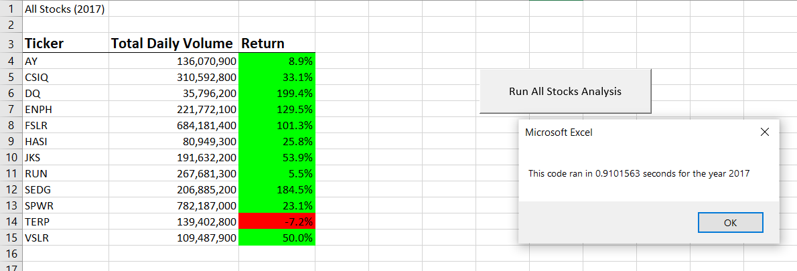
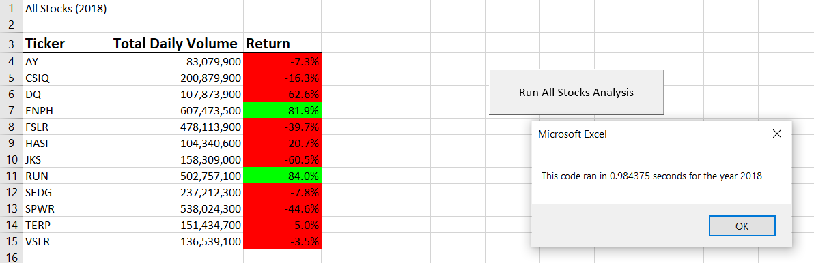

# **stock-analysis**
Stock Analysis using VBA macro.

## **Overview**
In this project we helped Steve to analyze green energy stocks using VBA macros. Steve just graduated from a financial institution and wants to help his parents to invest for the first time. His parents are interested in green energy stocks and want to invest in DAQO Energy Corp. Steve needs our help to analyze green stocks marked to make a best choice in diversifying his parents’ funds. 

This project was made using Excel’s extension application VBA macro. Using solution code that we created in macro, Steve will be able to reuse it for any stocks and reduce chances of any errors. 

## **Results**
Using codes in macro we were able to collect entire stock market data for 2017 and 2018. By summing up total daily value throughout a year of a stock we got yearly percentage of stocks performance. 

 
As we can see in the 2017 picture, most of the stocks had positive performance, especially DAQO Energy Corp, with almost 200% of return. 

Same stocks had different return percentages in 2018. Only two stocks out of all 12 had positive outcome. DAQO’s Energy Corp stocks were down more than 62%. 

By looking at the analyses for 2017/2018 we can tell:
- ENPH and RUN would be the first best options to invest in with positive return outcome for both years. 
- By refactoring our code, we decreased code runtime from 1.03 to 0.91 seconds, which makes refactoring the ultimate solution for large data sets.

## **Summary**
With our refactored solution code Steve will be able to help his parents and others to invest by analyzing stock markets. After comparing data with the original and refactored codes we can make the following conclusions:

### Advantages of refactoring the code are:
- Allows us to run larger data sets effectively 
- The shortest and most efficient way
- Allows us to run code in a shorter amount of time for bigger datasets 

### Disadvantages of refactoring the code are:
- Requires sufficient level of knowledge and experience 

